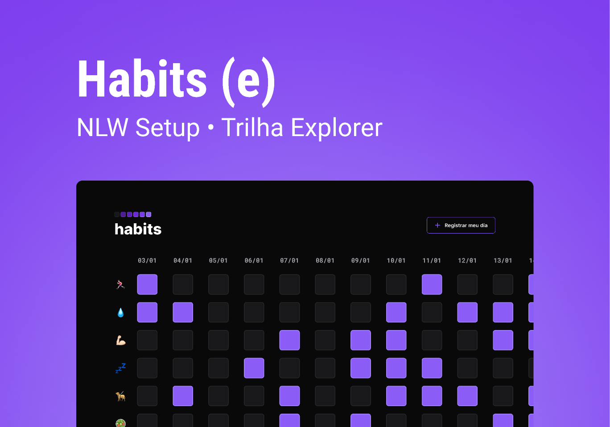

# Habits
 

> NLW Setup

Projeto feito utilizando os conceitos de HTML, CSS e JavaScript com o objetivo de ajudar o usuário com o registro de atividades diárias.

## [🔗 Clique aqui para acessar o projeto](https://loren175.github.io/nlw-setup)

#

## 📕 Layout
- Você pode visualizar o projeto do Figma através [desse link.](https://www.figma.com/community/file/1195326661124171197)

## 🚀 Tecnologias

- HTML
- CSS
- JavaScript
- Git e Github

## 📞 Contato

>rafael.loren175@gmail.com

>+55 (11) 99959-9140

## 👾 Discord

>rafas#7622